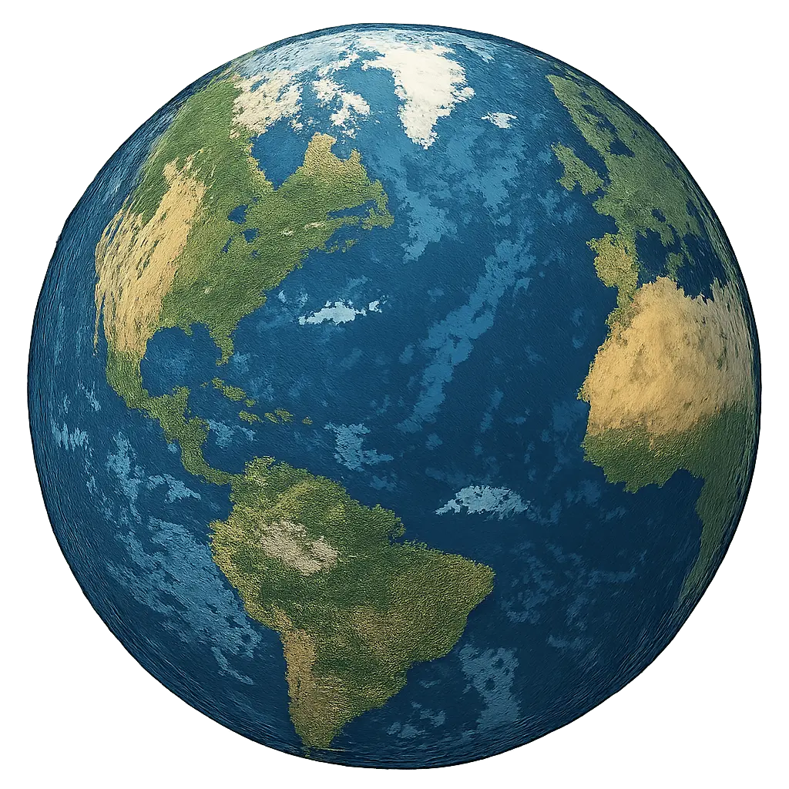
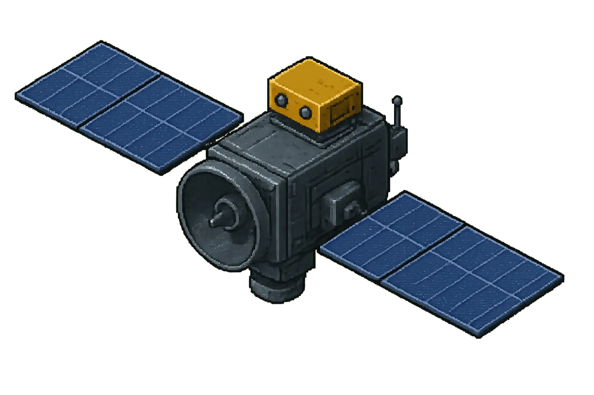
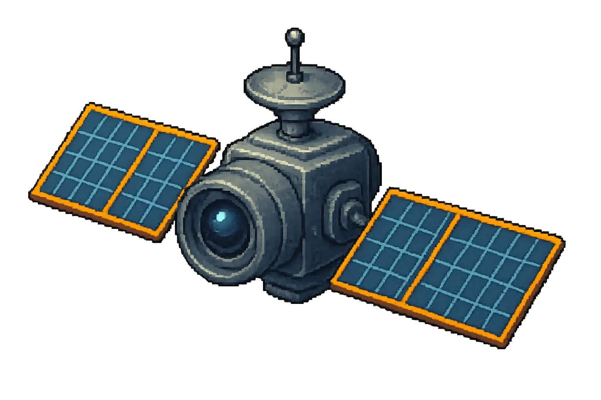
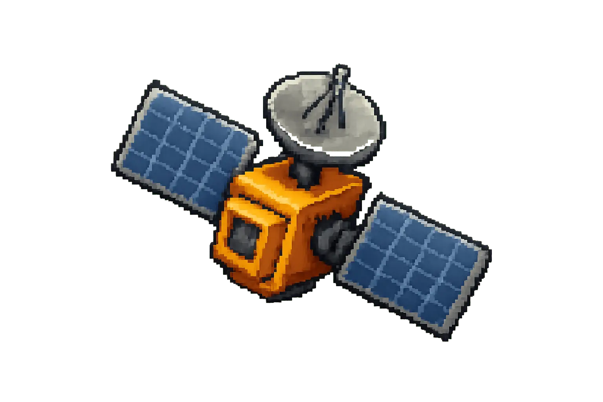

# 🚀 Ryan Little - Personal Website

  
  
  ## 🌍 Geospatial Analyst & Developer
  
  
  
  
  
  ### 🛰️ Interactive Space-Themed Portfolio
  
  

    
    
    
  

  
  **✨ Features:**
  🌟 Dynamic shooting star animations
  📱 Mobile-optimized experience
  🌙 Time-based Earth lighting system
  🛰️ Animated satellite navigation
  
  ### 🎯 **Visit the Live Site: [ryan-little.com](https://ryan-little.com)**
  
  
  
  ---
  
  *Built with vanilla JavaScript, CSS3 animations, and space-themed assets*

